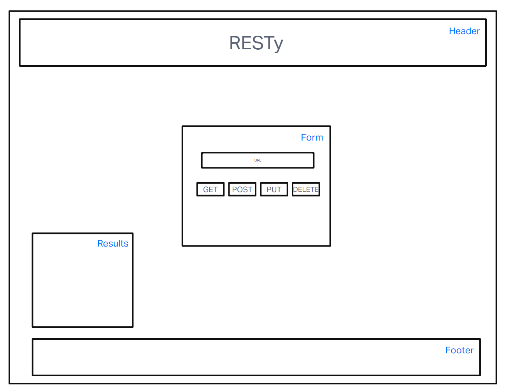

# resty

## Class 26
-change the components into functions.

[CodeSandbox - Class 26](https://codesandbox.io/p/github/j-davitt/resty/base?file=%2FREADME.md&workspace=%257B%2522activeFileId%2522%253A%2522clfhmg2s20002g3ej9e1l01ux%2522%252C%2522openFiles%2522%253A%255B%255D%252C%2522sidebarPanel%2522%253A%2522EXPLORER%2522%252C%2522gitSidebarPanel%2522%253A%2522COMMIT%2522%252C%2522spaces%2522%253A%257B%2522clfiyprzb00sb356k1uued31e%2522%253A%257B%2522key%2522%253A%2522clfiyprzb00sb356k1uued31e%2522%252C%2522name%2522%253A%2522Default%2522%252C%2522devtools%2522%253A%255B%257B%2522key%2522%253A%2522clfiyprzb00sc356khf9d2l8r%2522%252C%2522type%2522%253A%2522PROJECT_SETUP%2522%252C%2522isMinimized%2522%253Afalse%257D%255D%257D%257D%252C%2522currentSpace%2522%253A%2522clfiyprzb00sb356k1uued31e%2522%252C%2522spacesOrder%2522%253A%255B%2522clfiyprzb00sb356k1uued31e%2522%255D%252C%2522hideCodeEditor%2522%253Afalse%257D)

- added hooks

[CodeSandBox - Class 27](https://codesandbox.io/p/github/j-davitt/resty/state?file=%2FREADME.md&workspace=%257B%2522activeFileId%2522%253A%2522clfhmg2s20002g3ej9e1l01ux%2522%252C%2522openFiles%2522%253A%255B%255D%252C%2522sidebarPanel%2522%253A%2522EXPLORER%2522%252C%2522gitSidebarPanel%2522%253A%2522COMMIT%2522%252C%2522spaces%2522%253A%257B%2522clfiymond00lg356khbtmwtch%2522%253A%257B%2522key%2522%253A%2522clfiymond00lg356khbtmwtch%2522%252C%2522name%2522%253A%2522Default%2522%252C%2522devtools%2522%253A%255B%257B%2522key%2522%253A%2522clfiymond00lh356kwtjvk0gp%2522%252C%2522type%2522%253A%2522PROJECT_SETUP%2522%252C%2522isMinimized%2522%253Afalse%257D%252C%257B%2522type%2522%253A%2522PREVIEW%2522%252C%2522taskId%2522%253A%2522start%2522%252C%2522port%2522%253A3000%252C%2522key%2522%253A%2522clfiymond00li356ku0nmtv61%2522%252C%2522isMinimized%2522%253Afalse%257D%255D%257D%257D%252C%2522currentSpace%2522%253A%2522clfiymond00lg356khbtmwtch%2522%252C%2522spacesOrder%2522%253A%255B%2522clfiymond00lg356khbtmwtch%2522%255D%252C%2522hideCodeEditor%2522%253Afalse%257D)

- added useEffect

[CodeSandbox - Class 28](https://codesandbox.io/p/github/j-davitt/resty/effect-hook?file=%2FREADME.md&workspace=%257B%2522activeFileId%2522%253A%2522clfhmg2s20002g3ej9e1l01ux%2522%252C%2522openFiles%2522%253A%255B%255D%252C%2522sidebarPanel%2522%253A%2522EXPLORER%2522%252C%2522gitSidebarPanel%2522%253A%2522COMMIT%2522%252C%2522spaces%2522%253A%257B%2522clfk898jb0067356kxhen4qop%2522%253A%257B%2522key%2522%253A%2522clfk898jb0067356kxhen4qop%2522%252C%2522name%2522%253A%2522Default%2522%252C%2522devtools%2522%253A%255B%257B%2522key%2522%253A%2522clfk898jb0068356kfc2q11lr%2522%252C%2522type%2522%253A%2522PROJECT_SETUP%2522%252C%2522isMinimized%2522%253Afalse%257D%252C%257B%2522type%2522%253A%2522PREVIEW%2522%252C%2522taskId%2522%253A%2522start%2522%252C%2522port%2522%253A3000%252C%2522key%2522%253A%2522clfk898jc0069356k82l4lsss%2522%252C%2522isMinimized%2522%253Afalse%257D%255D%257D%257D%252C%2522currentSpace%2522%253A%2522clfk898jb0067356kxhen4qop%2522%252C%2522spacesOrder%2522%253A%255B%2522clfk898jb0067356kxhen4qop%2522%255D%252C%2522hideCodeEditor%2522%253Afalse%257D)

